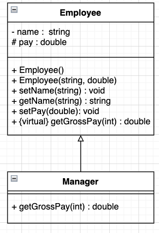
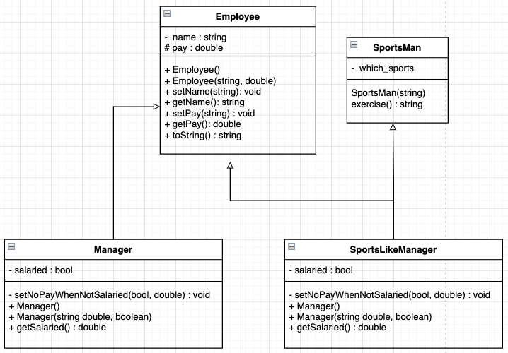

# Advanced C++
In this page, we are going to add some advanced C++ skills. 
- Obejct Oriented Programming in C++
- Standard Template Library(STL)
- Non-STL Datastructures
- Generic Programming
- Generic Algorithm
- Associative Containers
- Exception Handling

## Obejct Oriented Programming in C++
The main aim of OOP is to bind together the data and the functions that operate on them so that no other part of the code can access this data except that function.

- __Class__: Conceptually, we can say it is a blueprint representing a group of objects which shares some common behavior; technically, we may define it as the user-defined data type that holds its member data and functions.
- __Object__: An instance of a class has some characteristics and behavior of a class.

### Features in OOP
- __Encapsulation__: Binidng together the data and the functions that manipulate them. This also leads to data abstraction or hiding([about_encapsulation.cpp](about_encapsulation.cpp)).
- __Abstraction__: Displaying only essential information to the outside world and hiding background details and implemetation([about_abstraction.cpp](about_abstraction.cpp)). 
    - Abstraction using Classes. 
    - Abstraction using Header Files.  
- __Polymorphism__: Operation my exhibit different behaviours in different instances.The behaviour depends upon the types of data used in the operation.
    - How to overload: 
        - __Oprator Overloading__: The process of making an operator to exhibit different behaviours in different instances.
        - __Function Overloading__: Using a single function to perform different types of tasks.
    - Example: Employees and Manager
        - UML :  
        - Example Code: [gross_employee.cpp](polymorphism/about_polymorphism.cpp)
        

- __Inheritance__: The capability of a class to derive properties and characteristics. 
    - __Sub Class(Derived Class)__: The class that inherits properties from another class.
    - __Super Class(Base Class)__: The class whose properties are inherited by sub class.
    - In C++, One sub classes might inheritaed from multiple superclasses.
    - Example: Manager who like sports.
        - UML: 
        - Example Code: [about_inheritance.cpp](inheritance/about_inheritance.cpp)

## The C++ Standard Template Lbirary(STL)
The standard Template Library(STL) is a set of C++ template classes to provide common programming data structures and functions as lists, stacks, arrays, etc. The STL have the following components: 
 - Containers
 - Algorithms
 - Functors
 - Iterators

### STL Containers in C++
Containers store objects and data. We can seperate the containers as the follows:
- [Sequence Containers](stl/containers/sequence_containers/README.md): Access data in a sequential manner: __vector, list, deque, array, forward_list__.
- [Container Adaptors](stl/containers/container_adapters/README.md): provide a different interface for sequential containers: __queue__, __priority_queue__, __stack__).
- [ (unordered) Associative Containers](stl/containers/associative_containers/README.md): Implement unordered or sorted data structures that can be quickly searched(Big O(logn) complexity): __set__, __multi_set__, __map__, __multimap__, __unordered_set__, __unordered_multiset__, __unordered_map__, __unordered_multimap__).

### STL: Functors
__Functor__(or function object) is a C++ class that acts like a function.
- Example Code: [functor_example](stl/example_code/functor_example.cpp)

### STL: Iterators
An __Iterator__ is an object (like the pointer) that points to an element inside the container. The pointer can point to elements in an array and can iterate through them using the increament operator(++). There are following iterators in the cpp.

| Iterator      | Description                           | Features                                                                                          | Limitations                                                                           | 
|:---           |:---                                   | :---                                                                                              |:---                                                                                   |
|input          | Using for sequential accesing         | Single-Pass algorithm, Equality/Inequality, Dereferenceing, Incrementable, Swappable              | Assigning, Decremented, Multi-pass algorithm, Rational Operator, Arithmatic Operators |
|output         | Using for sequential assigning        | Single-Pass algorithm, Equality/Inequality, Dereferenceing, Incrementable, Swappable              | Accessing, Decremented, Multi-pass algorithm, Rational Operator, Arithmatic Operators |
|forward        | input + output, but forwardable only  | Multi-Pass algorithm, Equality/Inequality,  Dereferenceing, Incrementable, Swappable              | Decremented, Rational Operator, Arithmatic Operators, Dereference OP(`[]`)            |
|bidirection    | forward + backward                    | Multi-Pass algorithm, Equality/Inequality,  Dereferenceing, Incrementable, Decremented Swappable  | Rational Operator, Arithmatic Operators, Dereference OP(`[]`)                         |
|random access  | most powerful                         | Multi-Pass algorithm, Equality/Inequality,  Dereferenceing, Incrementable, Decremented Swappable   Rational Operator, Arithmatic Operators, Dereference OP(`[]`)                         ||

Note:
- Equality/Inequality Comparision: Use `==`, `!=` operator for comparision.
- Dereferenceing: `*A` to derefernce the element  and `A->m` to acceess the element. 
- Incrementable:  Use the post|pre increment (`++()`, `()++`) to access next element. 
- Swappable: Exchange the contents with the other one.

### STL: Utility
- [__Pair__](stl/containers/pair/README.md) : Pair is used to combine two different type values together. 

## Reference
[GeeksForGeeks: Introduction to Iterators in C++](https://www.geeksforgeeks.org/introduction-iterators-c/)