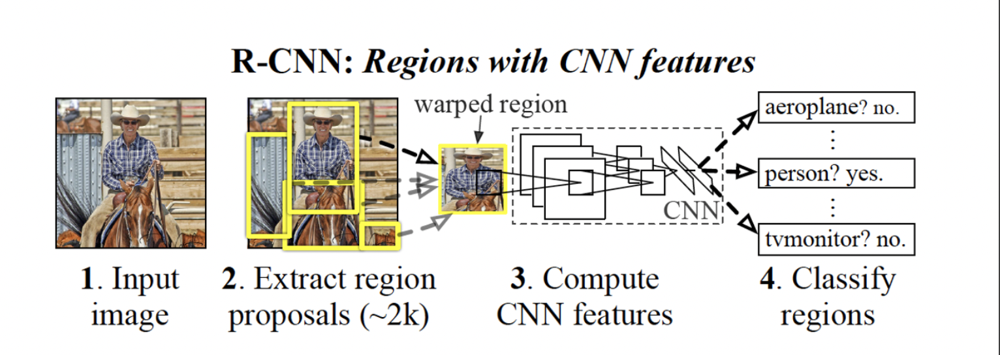
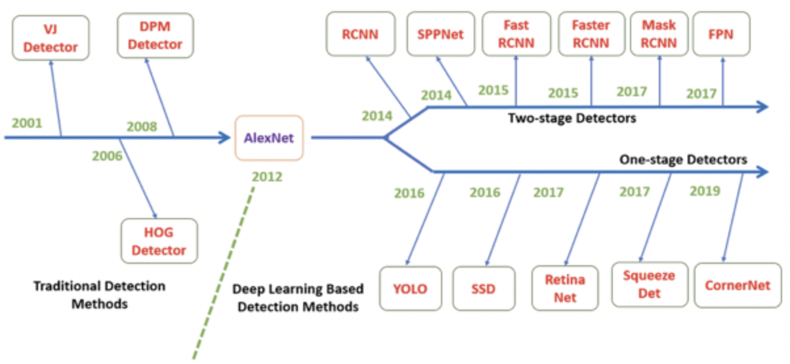

# Introduction
This page is made for understanding deep learning through multiple papers and practicing those deep learning skills such as CNN, R-CNN, Fast R-CNN, Faster R-RCNN, and Yolo.

## About R-CNN
R-CNN: Regions with CNN features.

### About Object Detection
- __Classicifation__: Detect __Multiple Objects__. 
- __Localization__: __Bounding Box__ the target Objects.
- Object Dectection = Multi-Labled Clasification + Bounding Box Regression
### Objection History

- __1-stage Detector__ : Run __Classification__ and __Localization__ concurrently. 
- __2-stage Detector__ : Run __Classification__ and __Localization__ respectively.
### Definition 
### How does it works?
1. Regional Proposal: Use the [selective search[1]](https://www.geeksforgeeks.org/selective-search-for-object-detection-r-cnn/)(Difference between the object color and texture) to enable a controlled comparision with prior dectection work.
1. Extracts a fixed-length feature vector from each proposal using a CNN.
1. Classifies each region with category-specific linear SVMs[(Support Vector Machines[2])](https://scikit-learn.org/stable/modules/svm.html#:~:text=Support%20vector%20machines%20(SVMs)%20are,than%20the%20number%20of%20samples.).
1. Bounding Box Regression.

### Practice1: Classify the Misinit From the CNN.
- Exercise1: Classify the minist with the [CNN](https://cs231n.github.io/convolutional-networks/):[exec1_classify_minist.ipynb](/exec1_classify_minist.ipynb)

## Reference 
- [1] selective search : https://www.geeksforgeeks.org/selective-search-for-object-detection-r-cnn/
- [2] SVM(Support Vector Machine) : https://scikit-learn.org/stable/modules/svm.html#:~:text=Support%20vector%20machines%20(SVMs)%20are,than%20the%20number%20of%20samples.
- [3] CNN(Convolutional Neural Networks): https://cs231n.github.io/convolutional-networks/