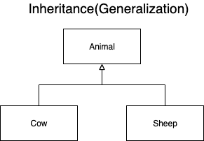
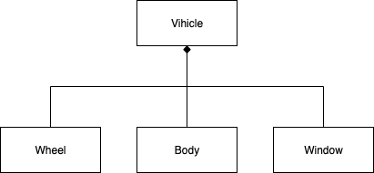
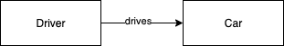
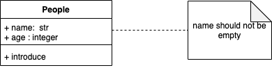

# Modern Design Pattern
## Concept
### What is the design pattern?
- Language & domain independant strategies for solving common object-oriented design problems.
- These problems are recurring and appear in all kinds of applications, irrespective of their language or platform
- Patterns provide suggetions - different ways to solve these common problems.
- Developers can use these suggetions as guidelines to create solutions for their problems. 
> The proposed solution can have different implementation alternatives, depending on the programming langguage, framework or specific platform.

### Catalog
| Creational| Structural| Behavioral| 
| :---:     | :---:     | :---:     | 
| Abstract Factory| Adapter | Chan of Reponsibililty |
| Builder   | Bridge    | Responsibility | 
| Prototype | Composite | Command   |
| Singleton | Decorator | Iterator  |
|           | Facade    | Mediator  |
|           | Flyweight | Memento   |
|           | Proxy     | Observer  |
|           |           | State     |
|           |           | Strategy  |
|           |           | Visitor   |           

### About UML
#### Inheritance(Generalization)

 - example: Abstract Class

#### Composition
- Part of relationship.
- Using diamond symbol.
- When the container destroyed, all of the contents are destroyed.



#### Aggregation
- The container owns the contents.
- Using hollow diamond
- When the parent instance destroyed, the child instance might not be destroyed, Since the child instance might be used in other instance.


#### Association
- The relationship shows aligned, which means the container object uses contained objects. 

#### Note   
- Enter additional comment not repressnted in diagram.
- Wring some essention information.


### SOLID Principles
#### Single Responsibility Principle
>A class should have only one reason to change. 
- A class should have only one responsibility.
- Classes with multiple responsibilities break when changed(Hard to maintance).
- Put each reponsibility in a separate class.
#### Open-Closed Principle
> Modules should be open for extension but closed for modification. 
    - Modification to existing code leads to bugs and cause the software to break. 
    - Change behavior of existing code without modification.
        - Instead the behavior should be changed by adding new code.
#### Liskov-Substituation Principle
> Subtypes must be substitutable for their base types.
- Applies to inheritance relationship.
- The inheritence relationship should be based on behavior.
- A subclass must have all the behaviors of its base type & must not remove or change its parent behavior.
- This allows a subclass to replace its base type in code.
- New subclasses can be added without modifying existing code.    
#### Interface Segregation Principle.
> Clients should not be forced to depend on methods they not use. (Fat Interface)
- An interface with too many methods will be complex to use. 
- Some clients may not use all the methods.
    - But will be forced to depend on them.
- Separate the interface and put methods basesd on the client usage.

```cpp
// Before Modification
struct IFile {
    virtual void Read() = 0; 
    virtual void Write() = 0; 
    virtual ~IFile() = default; 
}

// Solution -> Seperate Read and Write Operation
struct IRead{
    virtual void Read() = 0;
    virtual ~IRead() = default; 
}

struct IWrite{
    virtual void write() = 0; 
    virtual ~Iwrite() = default;
}
```

#### Dependency Inversion Principle
> Abstractions should not depend on details. Details should not depend on abstractions. 
- Abstraction means an interface and details mean classes.
    - If using a concrete class directly creates a dependancy 
        - Software becomes difficult to modify.
    - Invert the dependency by using an interface rather a concrete class, will guide you not to modify original code.

```cpp
// Assumption there are image reader interface and Bitamp and Concreate class bitmap reader
class ImageReader{
public: 
    virtual void Decode()=0;
    virtual ~ImageReader()=default ;
}
class BitmapReader : public ImageReader {
public: 
        void Decode(){}
};

// It is recommanded to use, interface than use concrete class.
class ImageViewer {
    ImageReader *m_Reader{} ;
public : 
    void Display(){}
};
```


