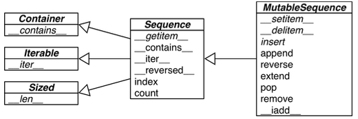

# Chapter2 Sequence

## 2.1 Built-in Sequence
### Container Sequence 
 Hold reference to the objects they contain, which may be of any type.
- list, tuple, collections.deque
### Flat Sequence 
Physically store the value of the each item with its own memory space.
- str, bytes, bytearray, [memoryview](https://docs.python.org/ko/3/c-api/memoryview.html), array.arry

## 2.2 List Comprehensions and Generator Expression

Advantage of using these features:
- more readable.
- faster

Example: 
[List Comprehensions and Generator Expressions.](0202list_comprehensions_and_generator_expression.ipynb)

Note: 
- List Comprehensions(지능형 리스트)

