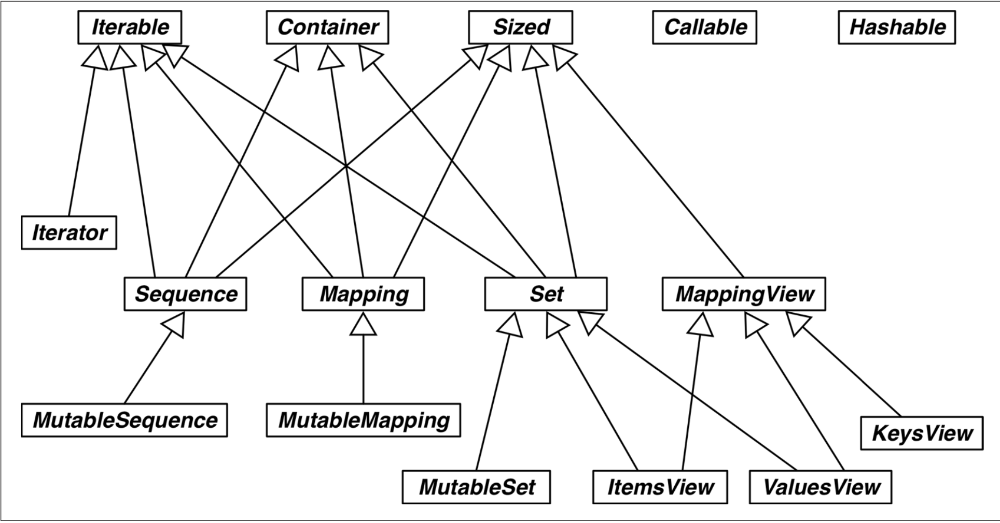

## Interfaces: From Protocols to ABCs
ABCs, like descriptors and metaclasses, are tools for building framewors. 

### Duck Typing: Monkey Patching
- Duck Typing: __Ignoring an object's actual type__, focusing instead on ensuring that the object implements the method names, signatures, and semantics required for its intended use.
- Monkey Patching: Changing a class or module at runtime, without touching the source code.
    - Monkey patching is powerful, but it often handling private and undocumented parts.
    - example code: 
        - Original French Deck: [french_deck.py](french_deck.py)
        - After Monkey Patching: [french_deck_monkey_patching.py](french_deck_monkey_patching.py)

### ABCs in the Standard Library
- Collections: Implement compatible protocals of __Iterable__, __Container__, __Sized__.
    - Iterable: `__iter__()` 
    - Container: `__contains__()`
    - Sized: `__len__()`
- Sequnce, Mapping, and Set: main immutable types. but have mutable subclass(MutableSequnce, Mutable Mapping, MutableSet)
- MappingView
    - `.items()` -> __ItemsView__ 
    - `.keys()` and `.values()`->__ValuesView__
- Callable and Hashable: Not closely related to collections, but included. The main usage is for the `isinstance()`
- Iterator: Will talk in Chapter 14.

#### The Numbers Tower of ABC
__numerical tower__: The number's package in ABC. 
- Number
- Complex: a+bi(a, b are real numbers, i is imaginary unit)
- Real 
- Rational: fractions.Fraction
- Integral

### Informal Interface(ABC)
Informal interface is a class that defines methods that can __overriden, but there's no strict enforcement__.
Informal way: make an unimplemented method and extend.
- ex: [informal.py](informal.py)
Formal way: Extends ABC.metaclass and implement abstract class and `__subclasshook__` The class which is used to check subclass
- ex: [formal.py](formal.py)

### Defining and Using an ABC
- example:
    - [Tombola ABC](tombola.py)
        - Extended [BingoCage](bingo.py), [LotteryBlower](lotto.py)
            - Basic class: abc.ABC
            - virtual method: `@abc.abstractmethod`
        - Implementation [TomboList](tombolist.py)
            - resgister implementing class `@Tombola.register`
        - Test Code: [tombola_runner-> Not verified](tombola_runner.py)
            - !!! need to understand how does doctest work.

