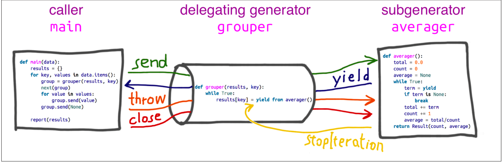

## Chapter15 Context Managers and else Blocks
In this chapter we are going to master `with` and `else` clauses:
- The `with` statement and context managers.
    - Prevent errors and reduces boilerplate code.
- The `else` clause in `for`, `while` and `try` statements.

### Do This, then That: else Blocks Beyond if
The `else` can be used in other sementics such as: 
- `for/else` : The else block will run only if and when the for __loop runs to completion__(not when for is aborted with a break).
    ```python
    item_list = ["banana", "apple", "bear", "strawberry", "blueberry"]
    item_to_find = "melon"
    for item in item_list:
        if item_to_find == item : break
        else: raise ValueError('We could not find the', item_to_find)

    # Result
    Traceback (most recent call last):
    File "<stdin>", line 4, in <module>
    ValueError: ('We could not find the', 'melon')
    
  
- `while/else` : The else block will run only if and when the while __loop exist because condition became false.__(not when for is aborted with a break)
    ```python
    item_list = ["banana", "apple", "bear", "strawberry", "blueberry"]
    while item_list:
        if item_list.pop() == item_to_find : break
    else : 
        raise ValueError('We could not found the', item_to_find)
    
    #Result 
    Traceback (most recent call last):
    File "<stdin>", line 4, in <module>
    ValueError: ('We could not found the', 'melon')
    ```
  
- `try/except/else`: Else block is called when there is no exception. Commonly used for control flow, and not just for error handling.
    ```python
    try: 
        dangerous_call() # open file
    except OSError:
        log('OSError...') # file not found
    else: 
        after_call() # close file
    ```

### Using yield from
- `yield from x expression` does with the x(iterable) objects is to obtain an iterator from it.
- The main feature of `yield from` is to open a bidirectional channel from the outermost caller to the innermost subgenerator, so that values can be sent and yiled back.
- Terms used in `yield from` syntax:
    - delegating generator: The generator function that contians the `yield from` \<itrerable> expression.
    - subgenerator : The generator obtained from the \<iterable> part of the `yield from` expression.
    - caler: Client who calls the delegating generator.

- Example:
    - figure  
    - code: [coroaverage3.py](coroaverage3.py)


- `yield from` features:
    - Subgenerator yields are passed directly to the caller of delegating generator.
    - Any values sent to the delegating generator using `send()` are passed directly to the subgenerator.
        - If sent value is not `None`, subgenerator's `__next__()` method is called.
        - If the call raises `StopIteration`, the delegating generator is resumed.
    - Return expr in a gnerator causes `StopIteration` to be raised upon exit from the generator.
    - The value of the `yield from` expression is the first argument to the `StopIteration` exception raised by the subgenerator when its terminates.

    - other features:
        - Exceptions (other than `GeneratorExit`) thown into the delegating generator are passed to the `throw()` method of subgenerator. 
            - If the call raises `StopIteration`, the delegating generator is resumed.
            - Otherwise propagated to the delegating generator.
        - If a `GeneratorExit` exception is thrown into the delegating generator(or the delegating generator's `close()` is called), then the `close()` method of the subgenerator is called. 
            - If there is any exception, it is propagated to the delegating generator.
            - Otherwiase `GeneratorExit` is raised in the delegating generator.
- Real life code:
        
