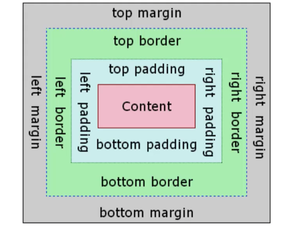

# Indroduction
- Cascading Style Sheet
    - Style: properties like color, font, size, borders.

- Link(`<link>`) the style sheet.
``` css
</title>
<link rel="stylesheet" href="part1_master.css">
<head>
``` 
- Color the tag([part1.html](part1.html), [part1_master.css](part1_master.css))
    - color: blue
    - color: rgb(red, green, blue)
    - color: rgba(red, green, blue, alpha)
        - alpha range: 0(opaque)~1(transparent)

- Other tag([part2.html](part2.html), [part2_master.css](part2_master.css))
    - `background` 
        - `background-color` : set the background color
        - `background-repeat` : repeat image or not
    - `border`: set the border
        - `border-color`: same as `color`
        - `border-width`: thin, thick, medium or exact pixel size(5px), 
        - `border-style`: double, dash, etc
- Link style to tags([part3.html](part3.html), [part3_master.css](part3_master.css))
    - `ids` : use ids to target a single elements.
        - `#className` shows that these are match single ids 
    - `classes`: use "classes" to target groups of elements.
        - `.className` to binding styles to certain classes.
    - use selectors to tag certain siblings.
        - tag1 `+` tag2: if the tag right after pathe other tags, fit the style.
        - tag1 (space) tag2 to show specify the tags inside of the other tag.
- About Fonts 
    - Part1([fonts_part1.html](fonts_part1.html), [fonts_part1.css](fonts_part1.css)):
        - `font-family`: Configuration the font.
        - `text-align`: The text position.
        - `font-style`: italic, normal, ...etc.
        - `font-weight`: bold, `actual value`... etc.
        -  customized fonts:
            - add `<link>` reference in html.
            - using the style of fonts. 

- About the box model
    - Structure of the box model: 
    - example:[box_models.html](box_models.html), [box_models.css](box_models.css)

- Part


    
## Reference
- About CSS1: https://www.w3schools.com/css/css_intro.asp
- About CSS2: https://developer.mozilla.org/ko/docs/Web/CSS
- Font Availible Info : https://cssfontstack.com
- Fonts Supplied by google: https://fonts.google.com
- Fonts Library: https://fontlibrary.org

